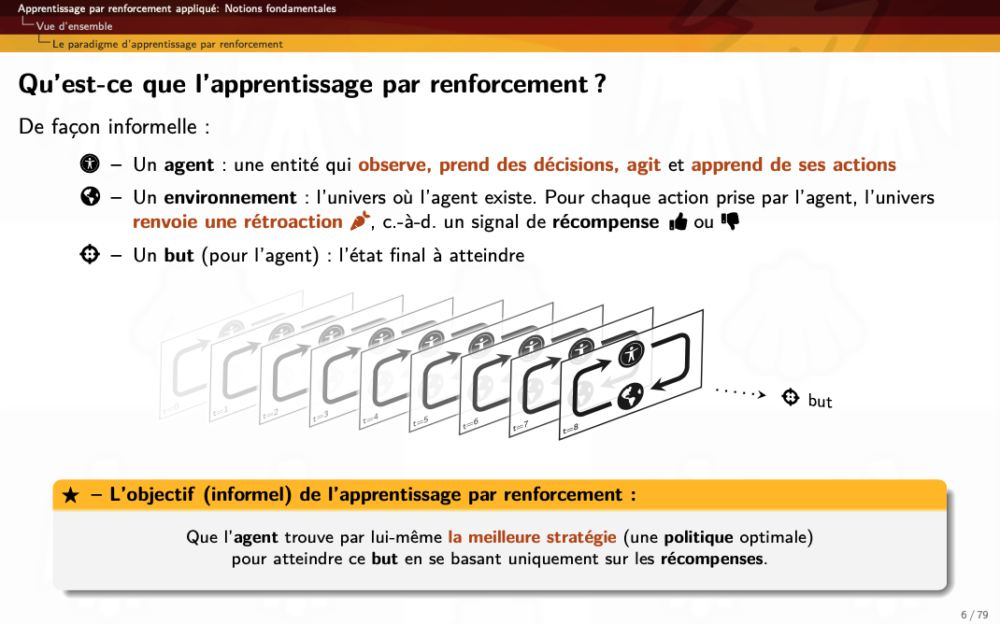

# Module sur l'apprentissage par renforcement appliquée 
Cours GLO-7050 | Apprentissage machine appliqué

#### Diapositive par:
 **Luc Coupal**, Université Laval, Montréal, QC, Canada, [Luc.Coupal.1@uLaval.ca](Luc.Coupal.1@uLaval.ca) 

#### Sous la supervision de:

**Professeur Brahim Chaib-draa**, Directeur du programme de baccalauréat en génie logiciel de l'Université Laval, Québec, QC, Canada,
[Brahim.Chaib-draa@ift.ulaval.ca](Brahim.Chaib-draa@ift.ulaval.ca)

---

### Télécharger les diapositives (format pdf): 
- [Apprentissage par renforcement appliquée | Notions fondamentales (version 3.2)](https://github.com/RedLeader962/GLO-7050-Module-Apprentissage-par-renforcement/raw/master/RL-Notions-fondamentales-v32.pdf) 
- [Apprentissage par renforcement appliquée | Algorithmes fondamentaux (version 3.2)](https://github.com/RedLeader962/GLO-7050-Module-Apprentissage-par-renforcement/raw/master/DPAndRL-Algorithmes-fondamentaux-v32.pdf) 
- Apprentissage par renforcement appliquée | Méthode approximative et DRL (à venir)
- Apprentissage par renforcement appliquée | Considérations appliquées (à venir)

---

    
    

    
    

---

 

