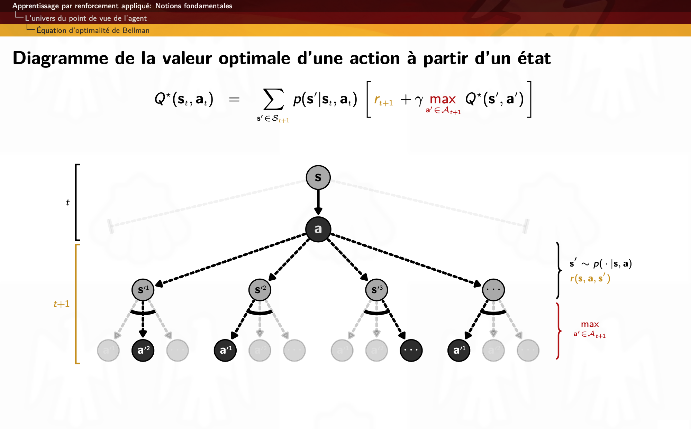
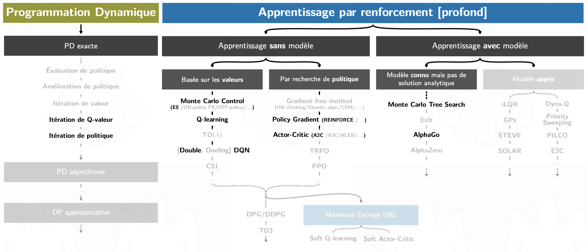

### Ressource pour le module APPRENTISSAGE PAR RENFORCEMENT APPLIQUÉ
du cours [**GLO-7050 APPRENTISSAGE MACHINE EN PRATIQUE**](https://www.ulaval.ca/les-etudes/cours/repertoire/detailsCours/glo-7050-apprentissage-machine-en-pratique.html#renseignements) donnée
par [**Professeur Brahim Chaib-draa**](https://www.fsg.ulaval.ca/departements/professeurs/brahim-chaib-draa-166/)
à l'[Université Laval](https://www.fsg.ulaval.ca), Qc, Canada.

**Synthèse et diapositive** du module RL par [**Luc Coupal**](https://redleader962.github.io)

### Télécharger les diapositives du module: 
- [Notions fondamentales (version 3.4)](https://github.com/RedLeader962/GLO-7050-Module-Apprentissage-par-renforcement/raw/master/RL-Notions-fondamentales-v3-4.pdf) 
- [Algorithmes fondamentaux (version 3.6)](https://github.com/RedLeader962/GLO-7050-Module-Apprentissage-par-renforcement/raw/master/RL-algorithmes-fondamentaux-v3-6.pdf) 
- [Deep Reinforcement Learning et méthodes approximatives (version 3.4)](https://github.com/RedLeader962/GLO-7050-Module-Apprentissage-par-renforcement/raw/master/DeepRL-et-methode-approximative-v3-4.pdf)
- (à venir) Considérations appliquées 

Pour **rapporter une erreur** dans les diapositives, allez en haut de la page à l'onglet `Issues` puis cliquez le bouton vert `New issue`. Précisez le nom du PDF, la page et le titre de la section/sous-section.

 

